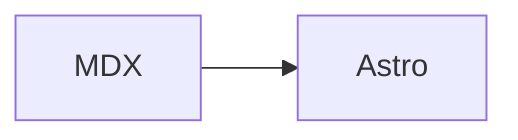

Un <Term tip="Markdown + JSX">MDX</Term> post.

<Callout type="tip">
  Set `published: false` to keep a draft out of the build.
</Callout>

```mermaid
flowchart LR
  A[MDX] --> B[Astro]
```

$$E = mc^2$$
